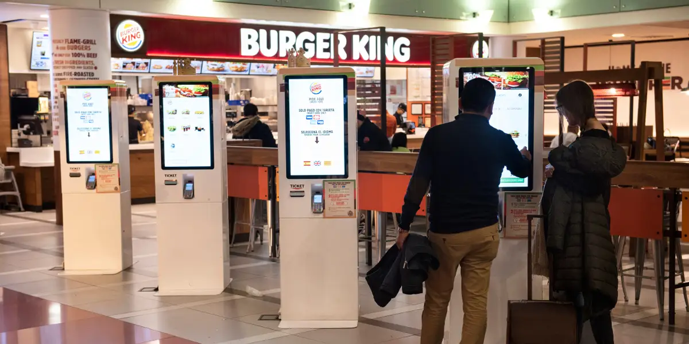

# Kiosk vs Me

David Carbajal 3/14/2025

I used to frequent fast food places when I was a kid but lost interest in fast food and starting to learn to cook for myself made me alien to how these places work. Last year I had just moved into my dorm, was dead tired and it felt too late into the day to go out for groceries and cook something. So seeing online that a burger place was nearby I said sure why not? I get into the restaurant and am greeted by the employees and told to order at the kiosk. I was confused because up to this point, I had never interacted with a kiosk to order food so after what felt like two minutes of trying to figure out where it even was I tackled these untreaded waters. And I ended up spending a long time trying to figure this thing out and I know it was a long time because I noticed the employees looking over at me with confused faces. One of the major issues was that there was no **feedback** when I pushed a button. Since the buttons aren't physical buttons because it's all just a screen I couldn't feel if I actually did something, it didn't even make a sound when I pushed something. It lacked responsiveness because I would push a button multiple times and due to some sort of input delay it would continue to select buttons at the point where I pushed. Eventually, I got my order done but the whole ordeal was frustrating and embarrassing that I just took my food back home to eat, the food was good at least. I know this interaction could have been more **efficient** if I just had some sort of **feedback** when I interacted with it. Some sound or just giving people a trackball mouse to use as an alternative would have gone a long way. If the kiosk I interacted with was faulty, some sound would have worked as a fail-safe to let the customer know that it was just acting slow and inform the employees that something may be working with it.
