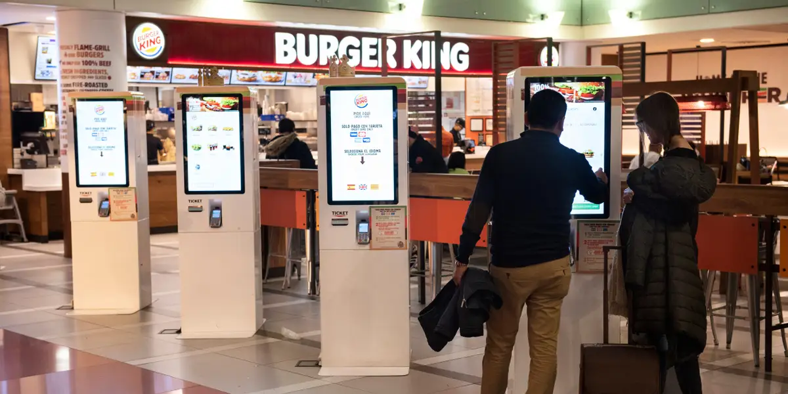
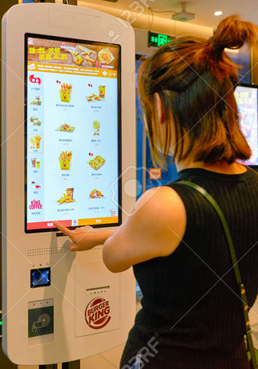

# Kiosk vs Me

David Carbajal 3/14/2025

As a kid, I used to go to fast food places a lot, but as I got older, I lost interest in fast food, and when I started to learn how to cook for myself, I stopped going to them altogether. Last year, I moved to a new dorm in a day and was dead tired, but it was too late in the day to look for a grocery store to stock up. I remembered seeing a burger place was nearby when I drove through the neighborhood, and I said, "Sure, why not?" Entering the restaurant, I get greeted by the employees and told to order at the kiosk. I was confused because up to this point, I had never interacted with a kiosk to order food, so after what felt like two minutes of trying to figure out where it even was, I tackled these untreaded waters. And I ended up spending a long time trying to figure this thing out, what buttons do what, where is the checkout, how do I edit my order, and I know it was a long time because I caught the convinced faces of employees wondering what's taking so long. One of the major issues was that there was no **feedback** when I pushed a button. Since the buttons aren't physical buttons because it's all just a big screen, I couldn't feel if I actually did something; it didn't even make a sound when I pushed a button. It lacked responsiveness because I would push a button multiple times, and due to some sort of input delay, it would continue to register my input at the point where I pushed. Eventually, I got my order done, but the whole ordeal was so frustrating and embarrassing that I just took my food back home to eat; the food was good, at least. I know this interaction could have been more **efficient** if I had just had some sort of **feedback** when I interacted with it. Some sound or just giving people a trackball mouse to use as an alternative would have gone a long way. If the kiosk I interacted with was faulty, some sound would have worked as a fail-safe to let the customer know that it was just acting slow and inform the employees that something may be working with it.
